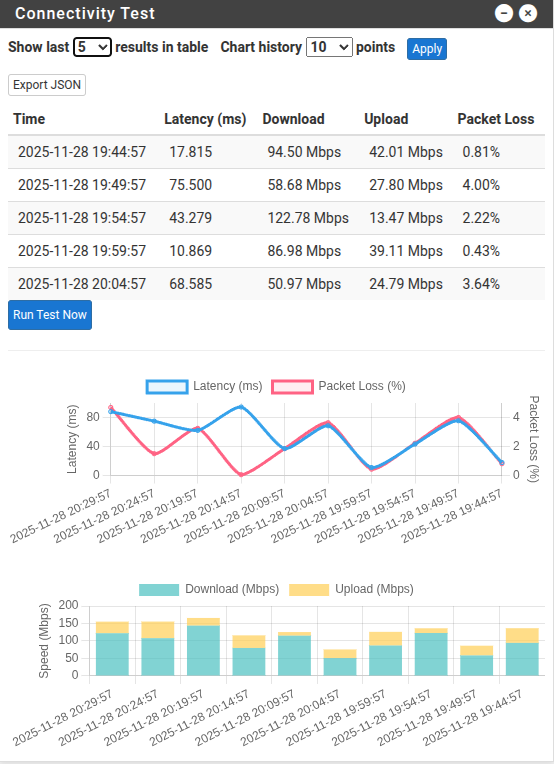

# pfSense Connectivity Test Widget

This project provides a simple connectivity test widget for the pfSense dashboard. It enables pfSense users to monitor their network latency and bandwidth directly from the dashboard, using scheduled speed tests and a visual widget.



## Features

- **Automated Connectivity Tests:** Periodically runs ping and speed tests (download/upload) using `speedtest-cli` or `speedtest-go`.
- **Dashboard Widget:** Displays recent test results (timestamp, latency, download, upload) in a table on the pfSense dashboard.
- **Customizable Schedule:** Installs a cron job to run the connectivity test script at a user-defined interval.
- **Easy Installation & Removal:** Includes an install script to set up or uninstall all components.

## Components

- `connectivity-test.sh`: Shell script that performs the connectivity and speed tests, saving results as JSON.
- `connectivity-test.widget.php`: PHP widget for the pfSense dashboard, displaying recent test results.
- `install.sh`: Installer script to automate setup and removal of the widget, script, data file, and cron job.

## Installation

1. **Copy the repository files to your pfSense system.**
2. **Run the installer:**
   ```sh
   ./install.sh --install
   ```
   Follow the prompts to install the required speedtest package and set up the widget.

3. **Add the widget to your pfSense dashboard:**
   - Go to the pfSense dashboard.
   - Click the "+" icon and add the "Connectivity Reports" widget.

## Uninstallation

To remove the widget and all related files:
```sh
./install.sh --uninstall
```
> **⚠️ Attention:** This will delete the connectivity test script, widget, data file (all historical test results will be lost), and cron job.

## Requirements

- pfSense 2.7 or newer (should work on FreeBSD 15, and above, tested on pfSense 2.8+)
- `speedtest-cli` or `speedtest-go` (installer will help you install one)
- Root privileges for installation

## Files and Paths

- **Test Script:** `/usr/local/bin/connectivity-test.sh`
- **Widget:** `/usr/local/www/widgets/widgets/connectivity_test.widget.php`
- **Data File:** `/usr/local/pkg/connectivity-test-report.json`
- **Cron Job:** `/etc/cron.d/connectivity-test`
- **Results Generation Script (for testing):** `generate-results.sh`

## License

MIT License

---

**Note:** This project is not affiliated with or endorsed by Netgate or the pfSense project.